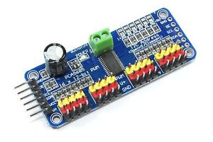

## pca9685

<p align="center">
  
</p>

### About

Node is responsible for the receiving signals and precessing them in the PCA9685 board.

The PCA9685 is an I2C-bus controlled 16-channel LED controller optimized for
Red/Green/Blue/Amber (RGBA) color backlighting applications

### Feature

1. Contains an I2C-controlled PWM driver with a built-in clock. It means, unlike the TLC5940 family, you do not need to continuously send it signals tying up your microcontroller; it's completely free running!
2. 5V compliant, which means you can control it from a 3.3V microcontroller and still safely drive up to 6V outputs, which is good when you want to control white or blue LEDs with a 3.4V+ forward voltage
3. Supports using only two pins to control 16 free-running PWM outputs – you can even chain up 62 breakouts to control up to 992 PWM outputs.
4. 3 pin connectors in 4 groups, so you can plug in 16 servos at one time.
5. 12-bit resolution for each output - for servos, that means about 4us resolution at an update rate of 60Hz.

For more information:
- http://wiki.sunfounder.cc/index.php?title=PCA9685_16_Channel_12_Bit_PWM_Servo_Driver
- https://cdn-shop.adafruit.com/datasheets/PCA9685.pdf


### How to start the node

In order to start the node, use the following commands
```
git clone git@github.com:project-omicron/pca9685.git
cd ./pca9685/
sudo pip3 install -r requirements.txt
roslaunch launch/pca9685.launch
```

### Limitations

Node depends on the libary ```Adafruit_PCA9685``` that is available for Raspberry Pi, for example, but it will not run on x86 systems.
